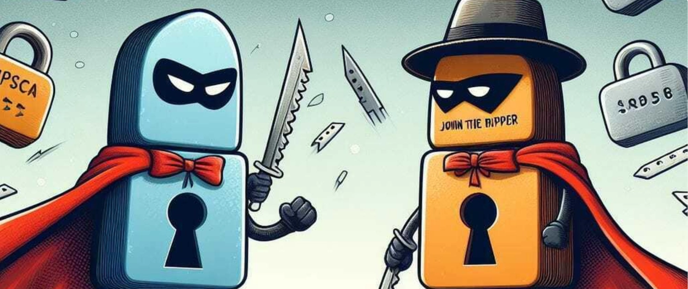

# Hashcat and John the Ripper: tools for password auditing

[](./README_EN.md)
[](./pdf/Saggio_Hashcat_John_the_Ripper_revisione.pdf)
[](./README_EN.md)
[](./LICENSE)

> Italian version: [README.md](./README.md)

<p align="center">
  
</p>

## Overview

This repository contains a technical and academic essay about Hashcat and John the Ripper, with a focus on defensive security, education, and authorized password assessment.

> **Responsible use:** the tools described must be used only on systems, accounts, and data for which explicit authorization is available.

## Contents

- [Cover](#cover)
- [Document information](#document-information)
- [Abstract](#abstract)
- [Keywords](#keywords)
- [Topics](#topics)
- [Full document](#full-document)
- [Documentation](#documentation)
- [Repository structure](#repository-structure)
- [Responsibility and safe use](#responsibility-and-safe-use)
- [Why this project](#why-this-project)
- [Author](#author)
- [License](#license)
- [Support the project](#support-the-project)
- [Citation](#citation)

## Document information

| Field | Information |
| --- | --- |
| **Title** | Hashcat and John the Ripper: tools for password auditing |
| **Author** | Vincenzo La Rocca |
| **GitHub profile** | [@michael4521786-gif](https://github.com/michael4521786-gif) |
| **Language** | English |
| **Date** | September 23, 2026 |
| **Type** | Technical essay and academic report |
| **Status** | Published and available for consultation |

## Abstract

This paper presents Hashcat and John the Ripper, two tools widely used in password auditing and credential security assessment.

The document analyzes the role of hash functions, the main characteristics of both tools, possible usage scenarios, and the methodological and technical differences between the two solutions.

The goal is to provide a defensive-security-oriented overview for education and authorized password-robustness assessment.

## Keywords

- Hashcat
- John the Ripper
- Password auditing
- Information security
- Password security
- Hashing
- Cybersecurity
- Penetration testing
- Defensive security
- Credential assessment

## Topics

- Introduction to password auditing
- Hash functions and password protection
- Overview of Hashcat
- Overview of John the Ripper
- Comparison between the two tools
- Performance and operational aspects
- Ethical and legal considerations
- Strategies to improve credential security

## Full document

The complete essay is available in PDF format:

[**Download the PDF**](./pdf/Saggio_Hashcat_John_the_Ripper_revisione.pdf)

## Documentation

- [Abstract](./docs/abstract.md)
- [Keywords](./docs/keywords.md)
- [Methodology](./docs/methodology.md)
- [Cover](./docs/cover.md)
- [Bibliography](./references/bibliography.md)
- [Citation data](./CITATION.cff)

## Repository structure

```text
.
├── README.md
├── README_EN.md
├── CITATION.cff
├── LICENSE
├── .gitignore
├── docs/
│   ├── abstract.md
│   ├── keywords.md
│   ├── cover.md
│   └── methodology.md
├── pdf/
│   └── Saggio_Hashcat_John_the_Ripper_revisione.pdf
├── assets/
│   ├── cover.png
│   └── paypal_qr.png
└── references/
    └── bibliography.md
```

## Responsibility and safe use

This project is intended for educational, academic, and defensive purposes.

Hashcat and John the Ripper must be used only:

- on systems you own;
- in authorized laboratory environments;
- during formally approved security activities;
- on accounts, hashes, and data for which explicit authorization exists.

They must not be used to access systems improperly, recover others' credentials, or violate anyone's privacy.

## Why this project

This repository was created to present, in an organized way, a technical essay about password analysis and a comparison of two important tools in the field of information security.

The aim is not to provide instructions for unauthorized attacks, but to offer a technical, methodological, and educational context for understanding:

- how hashes work;
- the role of password auditing;
- the strengths and limitations of Hashcat and John the Ripper;
- the importance of responsible, authorized defensive security.

## Author

**Vincenzo La Rocca**

GitHub profile: [@michael4521786-gif](https://github.com/michael4521786-gif)

## License

This repository’s documentation is distributed under the [Creative Commons Attribution-NonCommercial-ShareAlike 4.0 International](https://creativecommons.org/licenses/by-nc-sa/4.0/) license, unless otherwise stated.

For complete details, see the [LICENSE](./LICENSE) file.

## ☕ Support the project

If you found this project useful and would like to support its development, you can buy me a coffee via PayPal.

<p align="center">
  
</p>

<p align="center">
  <strong>Scan the QR code with the PayPal app</strong><br>
  Thank you for your support!
</p>

## Citation

To cite this work, see the [`CITATION.cff`](./CITATION.cff) file.
